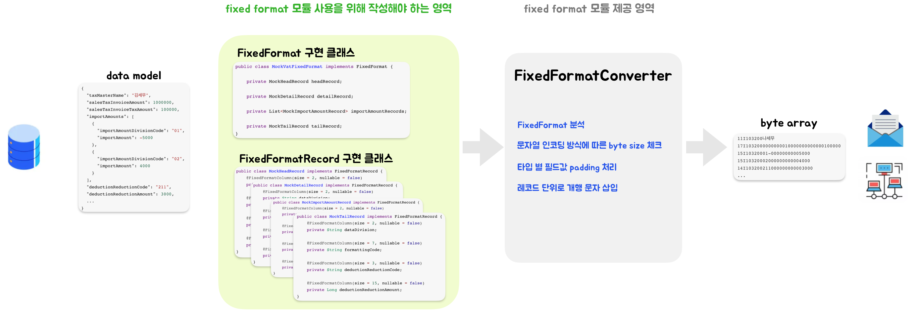
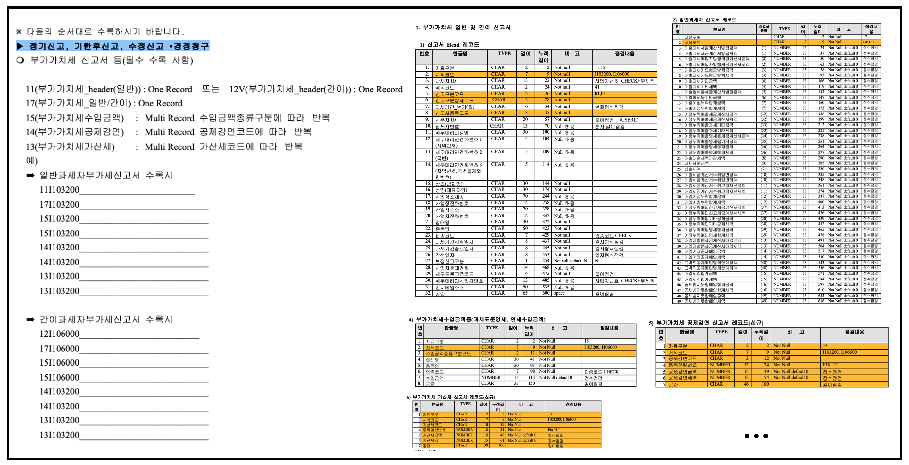

# Fixed Format

## 전문 메시지 변환기 (fixed length format message translator)



- fixed format 모듈은 내부 시스템에서 관리하는 데이터 모델을 외부 시스템에서 요구하는 전문 양식으로 변환하는 따분한 과정을 제거하고, 유지보수성을 향상시켜줍니다.
- 더이상 고정된 byte값으로 변환하기 위해 필드 단위로 패딩 처리하고, 인코딩 방식에 따라 달라지는 한글의 byte size를 체크할 필요가 없습니다.
- fixed format 모듈에서 제공하는 어노테이션을 사용하여 필드 별 규칙을 정의하고, 전문의 전체 구조를 나타내는 클래스 파일만 작성하면 됩니다.
- fixed format 모듈은 사용자가 작성한 클래스 구조와 필드 별 어노테이션 값을 분석하여 내부 시스템의 데이터 모델을 외부 시스템에서 요구하는 규칙에 맞게 문자열로 변환해줍니다.
- 문자열 인코딩 방식(EUR-KR, UTF-8) 및 개행 문자열(CR, LF, CRLF), 패딩 규칙은 사용자가 원하는대로 변경 가능합니다.
- fixed format 모듈은 전문 byte array를 읽어서 내부 시스템의 데이터 모델로 인스턴스화 해주는 파싱 기능도 제공하는 양방향 변환기 입니다.

# 개요 (Overview)

아래의 json은 내부 시스템에서 관리하는 데이터 모델의 간단한 예시입니다.

실무에서 관리하는 데이터 모델은 더 복잡할 것입니다.

```json
{
  "taxMasterName": "김세무",
  "salesTaxInvoiceAmount": 1000000,
  "salesTaxInvoiceTaxAmount": 100000,
  "importAmounts": [
    {
      "importAmountDivisionCode": "01",
      "importAmount": -5000
    },
    {
      "importAmountDivisionCode": "02",
      "importAmount": 4000
    }
  ],
  "deductionReductionCode": "211",
  "deductionReductionAmount": 3000,
  ...
}
```

아래의 text는 외부 시스템에서 요구하는 고정된 길이의 문자열 예시입니다.

```text
11I103200나세무       
17I1032000000000010000000000000100000
15I10320001-00000000005000
15I10320002000000000004000
14I103200211000000000003000
...
```

아래와 같이 외부 기관에서 요구하는 전문 spec 기반으로 생성된 text입니다. 전문 spec을 살펴보면, 레코드 단위로 문자열 한행으로 매핑되는 것을 볼 수 있으며, 레코드의 필드 단위로 TYPE, 길이,
누적길이 등이 정의 되어있으며, 레코드 순서 및 반복 여부 등의 규칙도 정의 되어있습니다. 그리고, TYPE에 따라 고정 길이 byte로 매핑할 때, 요구하는 패딩 규칙도 spec 에 작성되어 있습니다. 이러한
규칙들을 모두 만족시키면서 데이터를 고정된 길이의 문자열로 변환해야 외부 시스템에서 전문을 정상적으로 읽을 수 있습니다.



# 사용법 (Usage)

1. 전문 spec 에 정의 되어있는 레코드 순서에 맞게 전문의 전체 구조를 나타내는 클래스를 작성합니다.

    - FixedFormat 인터페이스를 구현

   ```java
   public class MockVatFixedFormat implements FixedFormat {
   
       private MockHeadRecord headRecord;
   
       private MockDetailRecord detailRecord;
   
       private List<MockImportAmountRecord> importAmountRecords;
   
       private MockTailRecord tailRecord;
   }
   ```

2. 전문 spec 에 정의 되어있는 레코드의 클래스를 작성합니다.

    - FixedFormatRecord 인터페이스 구현
    - `@FixedFormatColumn` 어노테이션에 필드 별 규칙 입력

   ```java
   public class MockHeadRecord implements FixedFormatRecord {
       @FixedFormatColumn(size = 2, nullable = false)
       private String dataDivision;
   
       @FixedFormatColumn(size = 7, nullable = false)
       private String formattingCode;
   
       @FixedFormatColumn(size = 10, nullable = false)
       private String taxMasterName;
   
       @FixedFormatColumn(size = 3)
       private String blankSpace;
   }
   
   public class MockDetailRecord implements FixedFormatRecord {
       @FixedFormatColumn(size = 2, nullable = false)
       private String dataDivision;
   
       @FixedFormatColumn(size = 7, nullable = false)
       private String formattingCode;
   
       @FixedFormatColumn(size = 15, nullable = false)
       private Long salesTaxInvoiceAmount;
   
       @FixedFormatColumn(size = 13, nullable = false)
       private Long salesTaxInvoiceTaxAmount;
   }
   
   public class MockImportAmountRecord implements FixedFormatRecord {
       @FixedFormatColumn(size = 2, nullable = false)
       private String dataDivision;
   
       @FixedFormatColumn(size = 7, nullable = false)
       private String formattingCode;
   
       @FixedFormatColumn(size = 2, nullable = false)
       private String importAmountDivisionCode;
   
       @FixedFormatColumn(size = 15, nullable = false)
       private Long importAmount;
   }
   
   public class MockTailRecord implements FixedFormatRecord {
       @FixedFormatColumn(size = 2, nullable = false)
       private String dataDivision;
   
       @FixedFormatColumn(size = 7, nullable = false)
       private String formattingCode;
   
       @FixedFormatColumn(size = 3, nullable = false)
       private String deductionReductionCode;
   
       @FixedFormatColumn(size = 15, nullable = false)
       private Long deductionReductionAmount;
   }
   ```

3. fixed format converter 인스턴스를 생성합니다.

    - `FixedFormatFactory` 를 통해 포맷터, 문자열 인코딩 방식, 개행문자 등의 default option이 적용된 converter 인스턴스를 간단하게 생성할 수 있습니다.

   ```java
   FixedFormatConverter<MockVatFixedFormat> = fixedFormatConverter = fixedFormatFactory.getConverter();
   ```

4. fixed format converter의 `convert` 메소드를 호출합니다.

    - 사전에 정의해둔 FixedFormat 에 전문 변환할 데이터를 채운 뒤, FixedFormatConvert의 `convert` 메소드를 호출하면, 전문 spec 요구사항을 만족하는 전문 text 문자열이
      byte array 로 반환됩니다.
    - byte array를 파일로 저장할지 네트워크 송신할지는 사용자가 결정하면 됩니다.

   ```java
   // given
   MockVatDataJson mockVatDataJson = loadMockDataJson();
   FixedFormat vatFixedFormat = MockVatFixedFormat.of(mockVatDataJson);
   
   // when
   byte[] bytes = fixedFormatConverter.convert(vatFixedFormat);
   ```

보다 상세한 사용방법을 이해하기 위해서는 Test Code를 확인해주세요.
